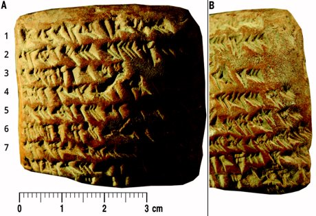
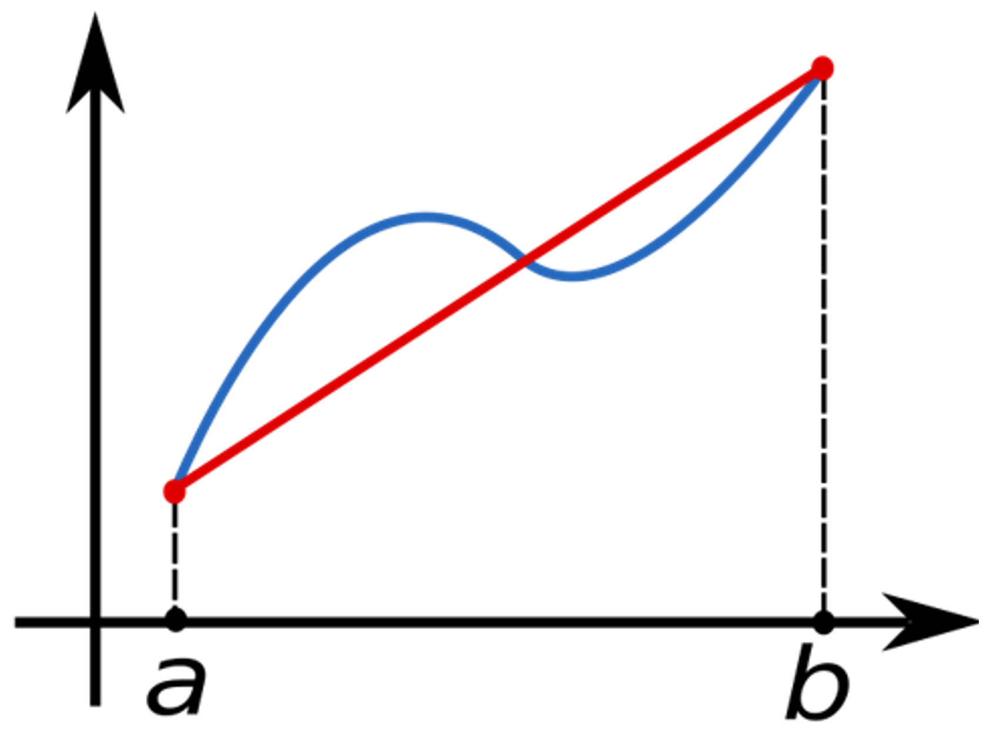
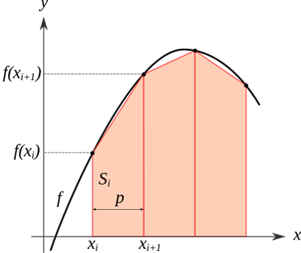
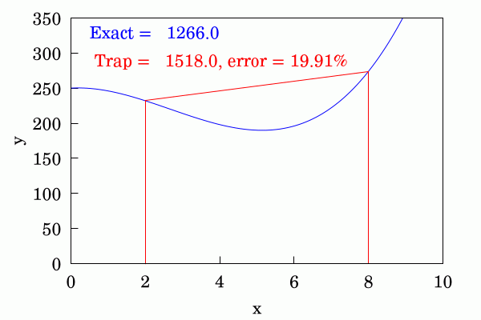

```{r setup, include=FALSE}
options(htmltools.preserve.raw = FALSE)
```

```{r xaringan-themer, include=FALSE, warning=FALSE}
library(xaringanthemer)
style_mono_accent(
  base_color = "#35338f",base_font_size = "23px",
  header_font_google = google_font("Josefin Sans"),
  text_font_google   = google_font("Montserrat", "300", "300i"),
  code_font_google   = google_font("Fira Mono")
)
```

```{r xaringan-logo, echo=FALSE}
xaringanExtra::use_logo(
  image_url = "logo.png"
  # ,position = xaringanExtra::css_position(top = "1em", right = "1em")
  ,width = "100px"
)

```
## Integrantes do grupo
* Eduardo Felipe de Oliveira
* Heitor Xavier Barros
* Leonardo Jardim da Silva Faria
* Ronaldo Salles Gusmão
* Tiago Abreu de Andrade
---
class: inverse, center, middle

# Motivação
---
## Motivação
</br>
#### Nós podemos usar somas de Riemann para aproximar a área debaixo de uma função. 
</br>
#### Somas de Riemann usam retângulos, o que nos leva a algumas aproximações bem forçadas.
</br>
#### Mas e se usarmos trapézios para aproximar a área debaixo de uma função em vez de retângulos?
---
class: inverse, center, middle

# Contextualização
---
## Contextualização

.pull-left[
<ul>
<li>A Regra do Trapézio é uma técnica para resolver numericamente <strong>integrais definidas</strong>.
</ul>
</br>
<ul>
<li style='margin-top:10px'>Um artigo da Science, de 2016, informa que esse método foi usado na Babilônia desde antes de 50 A.C. Os astrônomos babilônios estavam interessados em calcular a posição de Jupiter.
</ul>
]
.pull-right[
```{r echo=FALSE, out.width="100%", fig.align='center', dpi=600}

```
]
---
class: inverse, center, middle

# Teoria
---
## Teoria

.pull-left[
A ideia principal da Regra do Trapézio é aproximar a função por um **polinômio de primeiro grau**, ou seja uma reta.

Define-se a reta de forma que passe por $(a,f(a))$ e $(b,f(b))$, onde a e b definem o intervalo de integração.

Desta forma, a integral é a área delimitada entre a reta e o eixo x no intervalo $[a,b]$. O mesmo que a área de um trapézio. 
]
.pull-right[
```{r echo=FALSE,out.width = '800px', fig.align='center', dpi=600}

```
]
---
## Teoria

.pull-left[
A área pode ser aproximada por: 
</br>
$$I = \int_a^b f(x)dx \approx \frac{1}{2}*(b-a)*(f(a)+f(b))  .$$ 
]
.pull-right[
```{r echo=FALSE,out.width = '800px', fig.align='center', dpi=600}

```
]
---
## Teoria

A Regra do Trapézio apresenta um erro bastante considerável para funções diferentes de uma reta. Uma forma de diminuir esse erro é utilizar a **Regra do Trapézio Composta**. 
</br>

Na Regra do Trapézio Composta, particiona-se o intervalo inicial $[a,b]$ em $N$ subintervalos. Então em cada um deles é calculada a *Regra do Trapézio*.​
---
## Teoria

.pull-left[
A área pode ser aproximada por: 
</br>
$$I = \int_a^b f(x)dx \approx \sum_{k=1}^N \frac{f(x_{k-1})+f(x_k)}{2}\triangle{x_k},$$  
</br>
onde $\triangle{x_k}=x_k-x_{k-1}$.
]
.pull-right[
```{r echo=FALSE,out.width = '800px', fig.align='center', dpi=600}

```
]
---
## Teoria

Quando o intervalo de integração é dividido em $N$ subintervalos de mesmo tamanho, a área pode ser aproximada por:

$$I = \int_a^b f(x)dx \approx \triangle{x}*\sum_{k=1}^N\left( f(x_k)+\frac{f(x_N)+f(x_0)}{2}\right), $$
</br> 
onde $\triangle{x}=\frac{b-a}{N}$.
---
## Teoria
.pull-left[
O valor absoluto do erro de aproximação da Regra do Trapézio Composta é limitado por:

$|E|\leq \frac{(b-a)^3}{12N^2}[max\left|f''(x)\right|]$,    $a\leq x \leq b.$
</br>
 
]
.pull-right[
```{r, out.width="120%",echo=FALSE}

```
]
---
## Algoritmo

1. Faça $I = 0$ , $h = \frac{(b-a)}{N}$;

2. Faça $X[i] = a + i * h$, $i = 1, ..., (N-1)$;

3. Faça $Y[i] = f(X[i])$, $i = 1, ..., (N-1)$;

4. Faça $I = (1/2) * ( f(a) + f(b) )$;

5. Faça $I = I + Y[1] + ... + Y[N-1]$;

6. Faça $I = h * I$.
---
## Código no R
```{r eval=T}
regra_do_trapezio <- function(f, a, b, n) {
i = 0
h = (b-a)/n
x = a + 1:(n-1)*h
y = f(x)
i = (f(a) + f(b))/2
i = i + sum(y)
i = h*i
return(i)
}
```
---
## Exemplo

Suponha que as alturas, em centímetros, das mulheres de determinada população seguem uma distribuição **Normal(165, 6.25)**, e que as alturas dos homens seguem uma distribuição **Normal(172, 56)**. ​

Suponha também que uma mulher é escolhida aleatoriamente e, de forma independente, um homem é escolhido aleatoriamente.

Determine a probabilidade da mulher ser mais alta que o homem. Use a Regra do Trapézio Composta com $N=10$ para o cálculo das probabilidades. 
---
## Exemplo
Seja M uma v.a. que representa a altura de uma mulher na população mencionada no exemplo e seja H uma v.a. que representa a altura de um homem nessa mesma população.​

**M~N(165, 8)** e **H~N(172, 56)**.​

Seja $D=M-H$ uma v.a. que representa a diferença entre as alturas de uma mulher e um homem na população.

D~N(-7, 64).
---
## Exemplo
$$P(M-N>0) = P(D>0) = P[(D+7)/8)>7/8] = $$
</br>
$$ P(Z>0.875) = 0.5 - P(0 < Z ≤0.875) \tag*{, onde Z~N(0,1).} $$
</br>
$$P(0<Z≤0.875) = \int_0^{0.875} \frac{1}{2\pi}e^{-\frac{1}{2}Z^2}dz$$
</br> 
Aplicando a Regra do Trapézio Composta para resolver esta integral...
---
## Exemplo

1. Faça $I = 0$, $h = 0.0875$;​

2. Faça $X[i] = i * 0.0875$, $i = 1, ..., 9$;​

3. Faça $Y[i] = exp\{-(X[i]^2)/2\}/\sqrt{2π}$, $i = 1, ..., 9$;​

4. Faça $I = (1/2) * ( 0.3989 + 0.2721 )$;​

5. Faça $I = I + Y[1] + ... + Y[9]$;​

6. Faça $I = 0.0875 * I$
---
## Exemplo
```{r eval=T}
regra_do_trapezio(function(x) exp(-x^2/2)/sqrt(2*pi), 
                  0, 
                  0.875, 
                  10)
```

$$P(M-H>0) = 1 - (0.5 + 0.3091) = 0.1909$$

A probabilidade de uma mulher ser mais alta do que um homem é 0.1909.

---
class: inverse, center, middle

# Obrigado!
---
## Referências bibliográficas
<ul style="list-style-type:circle;font-size:20px">
<li>DeGroot, Morris H. Probability and Statistics. 4. ed. Addison-Wesley, 2012.​

<li>ECT/UFRN. "Regra do Trapézio." Disponível em: https://cn.ect.ufrn.br/index.php?r=conteudo%2Finteg-trapezio. Acesso em: 24 de setembro de 2023.​

<li>Khan Academy. "Entendendo a regra do trapézio." Disponível em: https://pt.khanacademy.org/math/ap-calculus-ab/ab-integration-new/ab-6-2/a/understanding-the-trapezoid-rule. Acesso em: 24 de setembro de 2023.​

<li>Larson, Ron. Cálculo aplicado. Tradução All Tasks. Revisão técnica Helena Maria Ávila de Castro. 1. ed. São Paulo: Cengage Learning, 2010.​

<li>Ossendrijver, Mathieu. "Ancient Babylonian astronomers calculated Jupiter's position from the area under a time-velocity graph." Science, v. 351, n. 6272, p. 482–484, Jan 29, 2016. doi: 10.1126/science.aad8085. PMID 26823423. S2CID 206644971.​

<li>Wikipedia. "Trapezoidal rule." Disponível em: https://en.wikipedia.org/wiki/Trapezoidal_rule. Acesso em: 24 de setembro de 2023.
</ul>